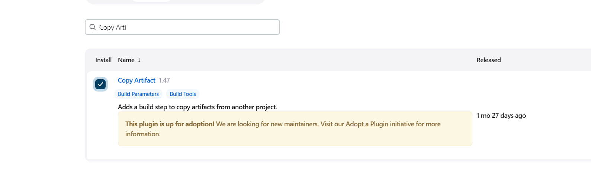
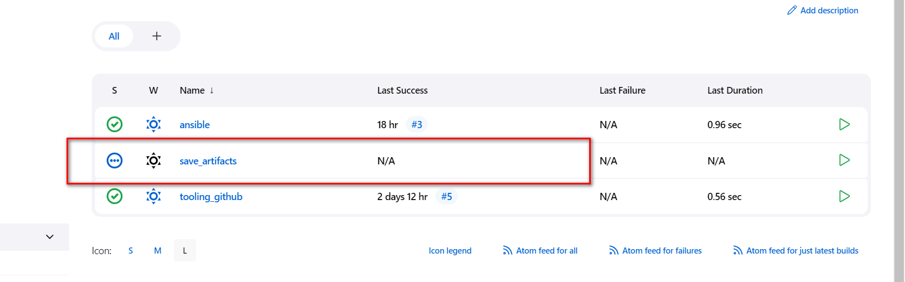
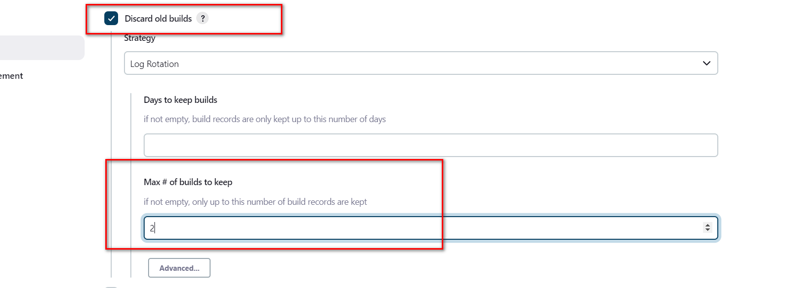
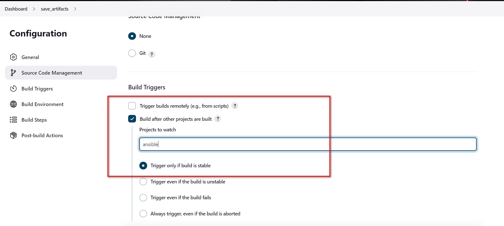
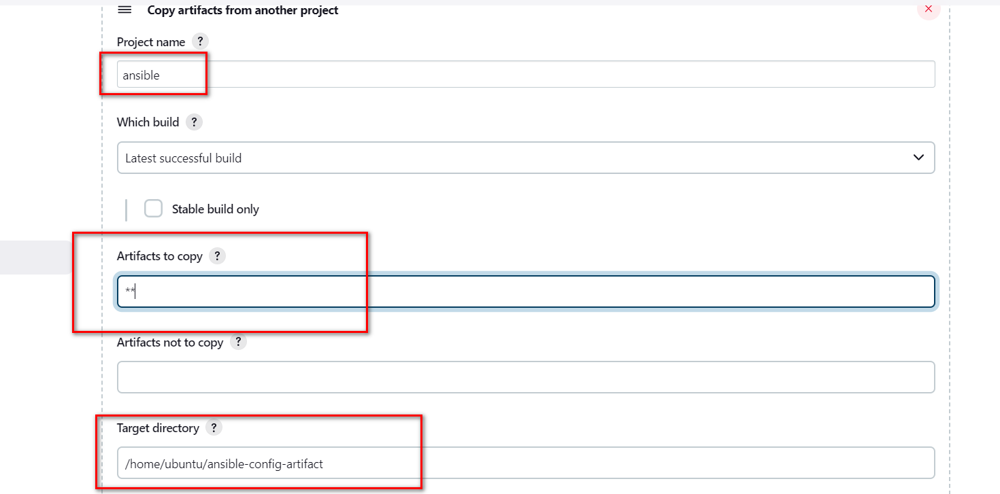
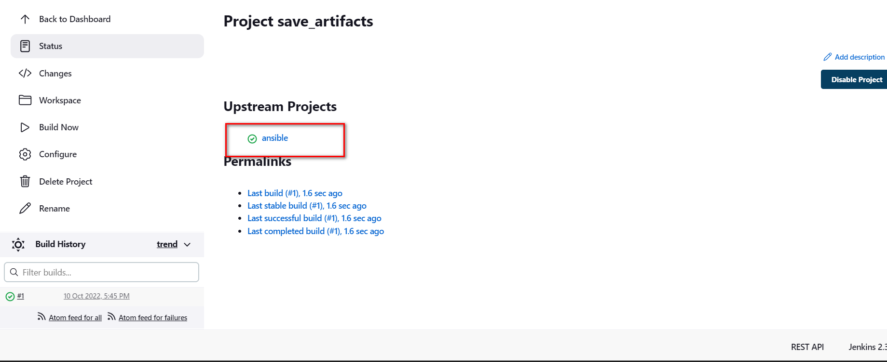
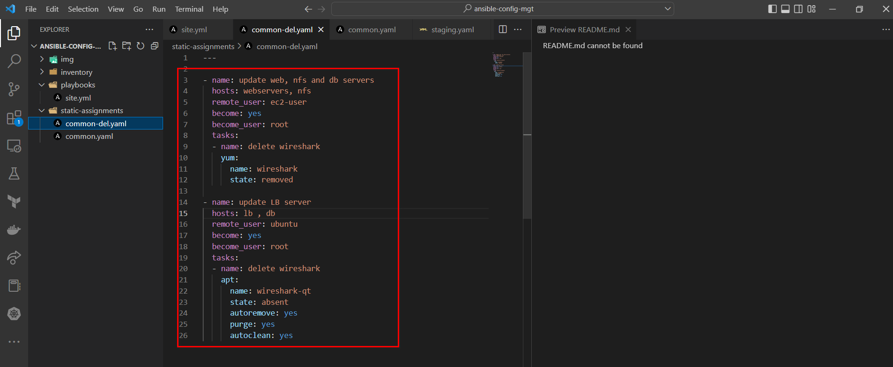
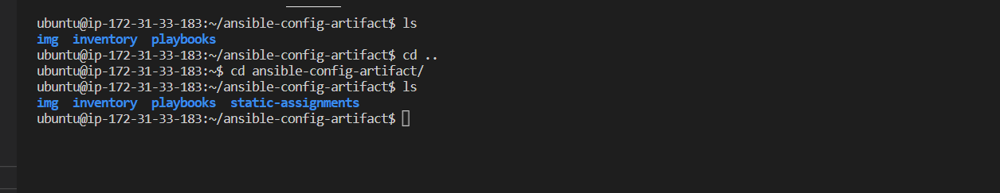
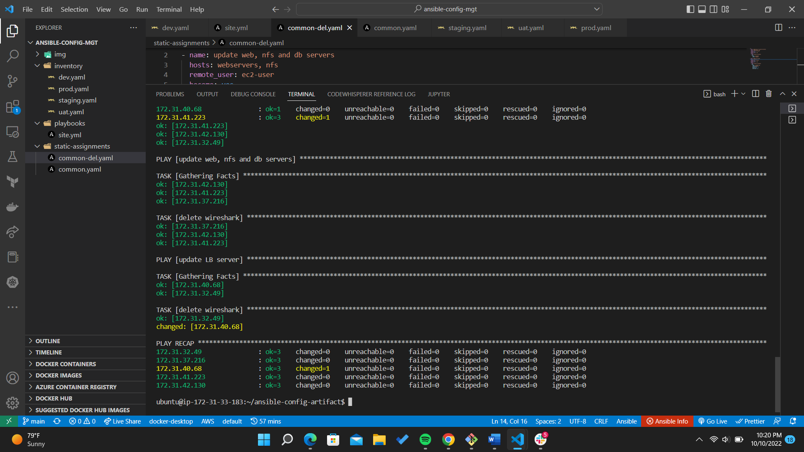

# Jenkins CI/CD on a 3-tier application && Ansible Configuration Management Dev and UAT servers using Static Assignments

## Ansible Refactoring and Static Assignments (IMPORTS AND ROLES)

In the previous project, I implemented CI/CD and Configuration Managment solution on the Development Servers using Ansible [Ansible_Automate_Project](https://github.com/Micah-Shallom/DevOps_Projects/tree/main/11.ANSIBLE%E2%80%93AUTOMATE_PROJECT_7_TO_10).


### **In this project, I will be extending the functionality of this architecture and introducing configurations for UAT environment.**


#

## STEP 1 - Jenkins Job Enhancement
#

Install a plugin on Jenkins-Ansible server called `COPY-ARTIFACTS`.


On the Jenkins-Ansible server, create a new directory called `ansible-config-artifact` <br/>
```
sudo mkdir /home/ubuntu/ansible-config-artifact
```
Change permission of the directory
```
chmod -R 0777 /home/ubuntu/ansible-config-artifact
```

Create a new Freestyle project and name it `save_artifacts`.



This project will be triggered by completion of your existing `ansible` project. Configure it accordingly:





We configured the number of build to 2. This is useful because whenever the jenkins pipeline runs, it creates a directory for the artifacts and it takes alot of space. By specifying the number of build, we can choose to keep only 2 of the latest builds and discard the rest.

Test your set up by making some change in README.MD file inside your ansible-config-mgt repository (right inside master/main branch).

If both Jenkins jobs have completed one after another – you shall see your files inside /home/ubuntu/ansible-config-artifact directory and it will be updated with every commit to your master branch.

Now your Jenkins pipeline is more neat and clean.

#

## Step 2 – Refactor Ansible code by importing other playbooks into site.yml
#

In [Project 11](https://github.com/Micah-Shallom/DevOps_Projects/tree/main/11.ANSIBLE%E2%80%93AUTOMATE_PROJECT_7_TO_10) , I wrote all tasks in a single playbook `common.yml`, now it is pretty simple set of instructions for only 2 types of OS, but imagine you have many more tasks and you need to apply this playbook to other servers with different requirements. In this case, you will have to read through the whole playbook to check if all tasks written there are applicable and is there anything that you need to add for certain server/OS families. Very fast it will become a tedious exercise and your playbook will become messy with many commented parts. Your DevOps colleagues will not appreciate such organization of your codes and it will be difficult for them to use your playbook.

- In playbooks folder, create a new file and name it `site.yml` – This file will now be considered as an entry point into the entire infrastructure configuration.

- Create a new folder in root of the repository and name it static-assignments. The static-assignments folder is where all other children playbooks will be stored
- Move common.yml file into the newly created static-assignments folder.

- Inside site.yml file, import common.yml playbook. 



- Run ansible-playbook command against the dev environment
- create another playbook under static-assignments and name it common-del.yml. In this playbook, configure deletion of wireshark utility.
```
---
- name: update web, nfs and db servers
  hosts: webservers, nfs, db
  remote_user: ec2-user
  become: yes
  become_user: root
  tasks:
  - name: delete wireshark
    yum:
      name: wireshark
      state: removed

- name: update LB server
  hosts: lb
  remote_user: ubuntu
  become: yes
  become_user: root
  tasks:
  - name: delete wireshark
    apt:
      name: wireshark-qt
      state: absent
      autoremove: yes
      purge: yes
      autoclean: yes
```
- We update site.yml with - import_playbook: ../static-assignments/common-del.yml instead of common.yml and run it against dev servers

```
cd /home/ubuntu/ansible-config-mgt/


ansible-playbook -i inventory/dev.yml playbooks/site.yaml
```

- Make sure that wireshark is deleted on all the servers by running wireshark --version
  



#

